<div align="center">
<div style="width: 100%; overflow-x: auto; background-color: #0d1117; padding: 15px; border-radius: 6px;">
<pre style="white-space: pre !important; word-wrap: normal !important; font-family: monospace; font-size: 14px; line-height: 1.2; margin: 0; color: #c9d1d9;">
 ██╗██╗        ███╗   ███╗  █████╗  ███████╗ ████████╗
 ██║█████╗     ████╗ ████║ ██╔══██╗ ██╔════╝ ╚══██╔══╝
 ██║████████╗  ██╔████╔██║ ███████║ ███████╗    ██║   
 ██║█████╔═╝   ██║╚██╔╝██║ ██╔══██║ ╚════██║    ██║   
 ██║██╔═╝      ██║ ╚═╝ ██║ ██║  ██║ ███████║    ██║   
 ╚═╝╚═╝        ╚═╝     ╚═╝ ╚═╝  ╚═╝ ╚══════╝    ╚═╝   
</pre>
</div>

### Keep Sail. Lose the juggling.

**A Linux-first desktop control center for Laravel Sail — now also at home on macOS and Windows.**

Manage all your Laravel Sail projects, containers, logs, workers, and development services from one place — without replacing Sail or Docker.

**Linux-first · macOS & Windows supported · Open source**

[**mast.sh**](https://mast.sh) · [**Download Mast**](../../releases/latest) · [Features](#features) · [Build from source](#development)

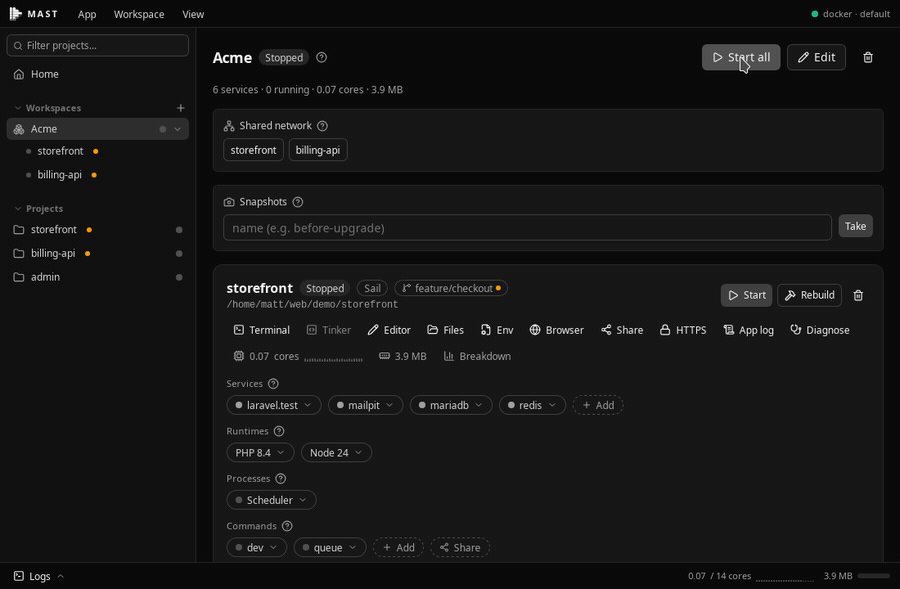

<sub>Starting a workspace in dependency order. Mast waits for each layer to become healthy before starting the next.</sub>

</div>

---

## Why Mast?

Laravel Sail works great from the terminal.

The friction starts when you're working across **several Laravel projects at once** — each with its own containers, logs, workers, Horizon, Reverb, databases, ports, and commands.

Mast gives your existing Sail projects a single control center.

- See every project and its current state at a glance.
- Start complete development workspaces in dependency order.
- Start, stop, and restart individual projects or services.
- Serve every project at a trusted `https://myapp.test` address — no more port juggling.
- View live logs without hunting through terminal tabs.
- Keep a container's last words when it dies, so the reason outlives the restart.
- Read the application log parsed — each error with its stack trace as one entry.
- See what each project costs in CPU and memory, and what to stop.
- Run Horizon, Reverb, queue workers, and project commands automatically.
- Diagnose and repair common local environment problems, with Fix buttons on failures.
- Share your running app at a temporary public URL — QR code included.
- Switch PHP and Node versions as single, verified operations.
- Copy database credentials and open service dashboards straight from their chips.
- Manage services and environment variables without leaving Mast.

### Mast doesn't replace Sail

Your existing Sail and Docker Compose workflow remains intact.

Docker remains the source of truth, and Mast stays in sync with changes made from the terminal. Your existing `compose.yaml`, `.env`, and Sail commands continue to work normally.

Close Mast and go straight back to the terminal whenever you want.

---

# Installation

## Platform support

| Platform       | Status                                                                        |
| -------------- | ----------------------------------------------------------------------------- |
| 🐧 **Linux**   | **Primary platform — tested and supported**                                   |
| 🍎 **macOS**   | **Tested and supported** (unsigned build: see the first-launch note below)    |
| 🪟 **Windows** | **Tested and supported** (unsigned installer: SmartScreen warns on first run) |

Mast is Linux-first: Linux is the primary development and testing platform. macOS and Windows are fully supported — field-tested against real Sail projects, with prebuilt binaries in every release.

## Requirements

- Docker Engine, reachable by your user
- Docker Compose v2 (`docker compose`)

## Command line

Every release ships the CLI (`mast` and `mast-daemon`) alongside the desktop app. To install just the CLI on Linux or macOS:

```bash
curl -fsSL https://mast.sh/install | sh
```

The binaries land in `~/.local/bin`; no `sudo` is involved anywhere.

**If the desktop app is already installed, the installer matches its version** rather than taking the latest release. That is deliberate. The CLI and the app share a per-user daemon socket so that both drive one engine — one mutation owner, one observation loop — and they compare builds when that socket is opened. A mismatched pair refuses to run and says which two things to line up, instead of failing later inside a deserialization error that names nothing useful. Builds agreeing on major and minor are compatible; patch releases never move the wire format.

```bash
# Pin a release instead (note sh's -s -- , since the script is on stdin)
curl -fsSL https://mast.sh/install | sh -s -- --version v0.5.0

# Install somewhere else
curl -fsSL https://mast.sh/install | sh -s -- --dir /usr/local/bin
curl -fsSL https://mast.sh/install | MAST_INSTALL_DIR=/usr/local/bin sh
```

On Windows, take `mast-<version>-windows-x86_64.zip` from the latest release. There is no prebuilt CLI for ARM Linux yet — [build from source](#development).

## Linux

Download the latest Mast release from:

**[Download Mast](../../releases/latest)**

### Debian / Ubuntu

Download the `.deb` package and install it with:

```bash
sudo apt install ./Mast_<version>_<architecture>.deb
```

### AppImage

Download the AppImage from the latest release. No installation is required.

Make it executable:

```bash
chmod +x Mast_<version>_<architecture>.AppImage
```

Then run it:

```bash
./Mast_<version>_<architecture>.AppImage
```

After starting Mast, open **Settings**, add the directories containing your projects, and import the projects Mast discovers.

## macOS

Download the `.dmg` for your chip (Apple Silicon `aarch64` or Intel `x64`) from the latest release, open it, and drag **Mast** into **Applications** as normal.

The build is unsigned, so the first launch is a two-step dance with Gatekeeper:

1. Open Mast — macOS warns that it cannot verify the app and refuses to open it.
2. Go to **System Settings → Privacy & Security**, scroll down to the note about Mast being blocked, and click **Open Anyway** — then confirm in the dialog.

macOS remembers the choice; every later launch is normal.

Works with Docker Desktop, OrbStack and colima — Mast finds the docker CLI even when the app is launched from Finder.

## Windows

Download the NSIS installer (`Mast_<version>_x64-setup.exe`) from the latest release. The installer is unsigned: SmartScreen will warn on first run (More info → Run anyway).

Requirements and notes:

- **Docker Desktop** (WSL2 backend) — Mast observes containers live over its named pipe and drives Sail projects through `docker compose` directly (the `sail` wrapper is a bash script Windows cannot run; Mast handles the translation, including `sail …` custom commands).
- Keep projects on a plain local path like `C:\dev\myapp` — OneDrive-synced folders fight bind mounts, and projects living _inside_ WSL2 (`\\wsl$\…`) are not supported yet.
- Fresh projects created by Mast's wizard are configured for Windows automatically (ports, writable storage, in-container PHP user). For projects created elsewhere, the **Diagnose** button knows the Windows-specific traps and fixes each with one click.

---

# Features

## One place for every Sail project

Mast automatically discovers Laravel Sail and Docker Compose projects from the directories you configure.

Every project shows its services, application processes, saved commands, and live container state.

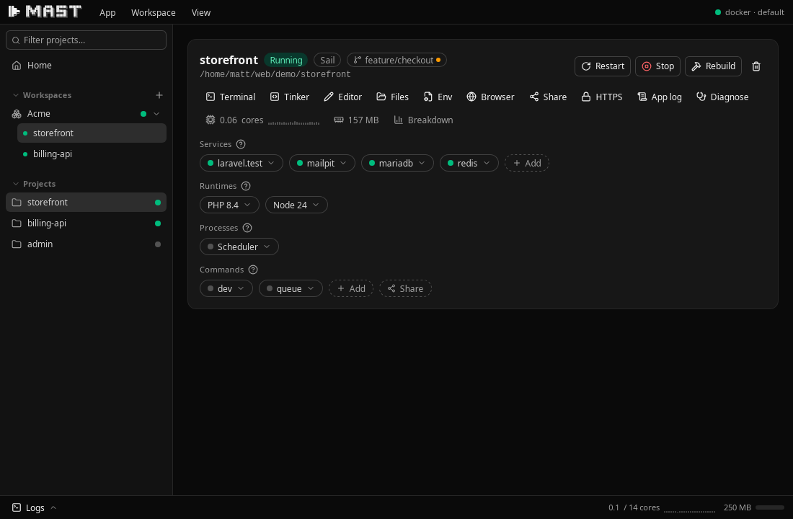

### Project & service controls

Start, stop, or restart an entire project or an individual service.

Mast reads the real Docker state rather than maintaining a separate idea of what should be running.

A service's chip also knows what the service is for. Mailpit, Meilisearch, or the MinIO console open in your browser from the chip — on whatever port they actually publish, so nobody memorises that Mailpit lives on 8025. A database chip offers **Connection info**: host, port, database, username, and password read fresh from `.env`, each with a copy button, plus a ready-made connection URL for TablePlus or DBeaver.

### Workspaces

Group related projects into workspaces and start them together.

Dependencies can be defined between workspace members. Mast starts each layer in order and waits for its dependencies to become healthy before continuing.

That means a workspace containing an API, frontend, and supporting applications can be brought up with one action instead of manually starting each repository.


---

## Development processes

Run the processes that belong to your Laravel application alongside its containers.

Mast can automatically start:

- Reverb
- Horizon
- Queue workers
- Saved project commands

These processes remain attached to the project they belong to rather than disappearing into another terminal window.

Saved commands can also run somewhere else: give one a working directory like `../frontend` and your separate frontend's dev server lives on the same card — streamed, stoppable, and startable together with the backend it belongs to.

---

## Share your site publicly

`sail share`, as a button. Publish the running app at a temporary public URL, scan the QR code to open it on your phone, and keep the tunnel's own output in view — the place where share problems actually explain themselves.

Mast shows exactly what will be shared before anything starts, warns when a Vite dev server would break the shared page's assets, picks a free dashboard port instead of dying on a busy one, and reliably stops the tunnel when you do.

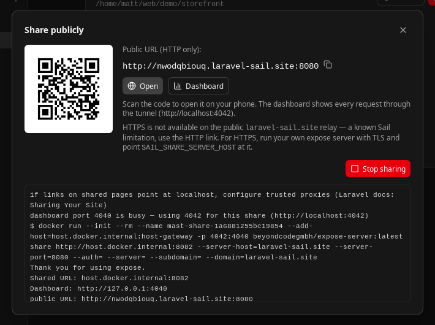

---

## Trusted HTTPS at https://myapp.test

Stop typing `localhost:8082`. Give a project a `.test` domain and Mast serves it over HTTPS through one shared local proxy — with a certificate your browser trusts, from an authority that exists only on your machine.

That unlocks the parts of development that plain `http://localhost` quietly breaks: secure cookies, service workers, camera and clipboard APIs, and OAuth callbacks that insist on HTTPS. The address also never changes when ports move.

Mast asks before touching anything system-level. The two one-time steps — a line in `/etc/hosts` and trusting the certificate authority — appear as previewed Fix buttons, each showing exactly what will change before an elevation prompt runs it.

Prefer doing it yourself? The dialog shows the exact hosts line and the certificate — path and PEM, each copyable — with a button that opens your hosts file.

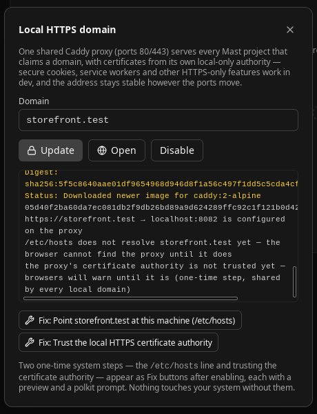

---

## Logs & captures

Follow any service's logs from inside Mast, without keeping a terminal tab open for each one.

A live log stream ends when its container does, and that is usually the moment the output becomes interesting. Worse, recreating a container — which `up -d` does whenever its configuration changed — starts a fresh log and discards the previous one entirely.

So Mast keeps the last minute of a container's output whenever it goes down:

- Before Mast stops, restarts, or rebuilds it — taken before the command runs, because a rebuild removes the container.
- When it exits or turns unhealthy on its own, including while Mast was closed.
- When a workspace start gives up waiting for it to become ready.
- On demand, from the service menu.

Captures are written to disk, so they survive both the container being replaced and Mast being restarted. Each one records why it was taken, and is listed newest first with a copy button.

Values that look like secrets in your `.env` are removed before a capture is stored — unlike a live stream, a capture is persisted and copyable.

And container logs are only half the story: the application confesses in `storage/logs/laravel.log`. The **App log** button shows it parsed — each error with its stack trace grouped as one entry, level badges, and an errors-only filter — instead of two hundred raw lines in an editor tab. When the history outlives its usefulness, one button clears the file in place.

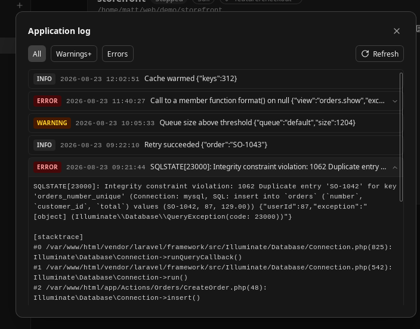

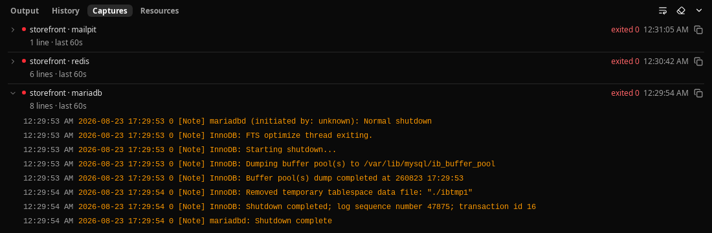

---

## Resource usage

See what your containers actually cost, per service, per project, per workspace, and in total.

CPU is reported in **cores** rather than a percentage. Docker's percentage is a share of every core at once, so `800%` is a real reading on an eight-core machine and a progress bar cannot express it. `2.3 of 8 cores` needs no explanation.

Memory is the **working set** — reclaimable page cache excluded, the same figure `docker stats` shows. A raw cgroup reading counts cache and can overstate a database container by an order of magnitude.

Where a container has a memory limit, Mast shows how close it is to it, which is the number that predicts an out-of-memory kill. Where there is no limit, the same bar shows its share of the machine instead.

The Resources tab ranks every running service across every project, so the answer to "what do I stop" is the top row. Sort by service, CPU, or memory by clicking a column.

Short histories are kept alongside each reading, because one CPU number cannot tell a momentary spike apart from a steady climb.

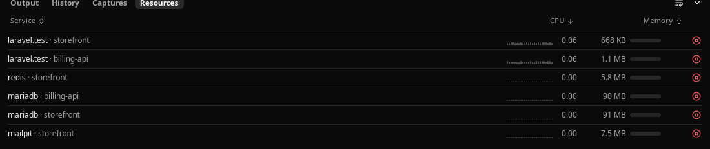

Sampling only runs while the Mast window is visible. Measuring the machine costs CPU, and a minimised Mast should not be part of the problem it reports on.

---

## System tray

You don't need to keep the Mast window open.

The system tray exposes the same project and workspace controls, so starting or stopping an environment is only a couple of clicks away.

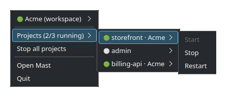

---

## Diagnostics & repairs

Local Docker environments break.

Mast checks for common problems and presents each finding with a guided repair.

Every repair has a risk tier and a preview of what Mast intends to change before anything is written.

The checks go after the problems that actually eat afternoons:

- Database says _Access denied_ after you changed `.env`? Mast fixes the live server without touching your data.
- Bumped a database version its data can't follow? Mast refuses the change that would crash-loop, and explains the safe path.
- Edited `.env` and nothing happened? Mast points at the cached config, or the exact containers that need recreating.
- Breakpoints never hit? The Xdebug check names which link in the chain is broken — one of them is a one-click fix.
- Pages suddenly have no CSS and rebuilding changes nothing? A leftover Vite dev-server file, deleted in one click.
- Still on MailHog, or files in `storage/` owned by root? One step each.

And when an operation fails, Mast reads the output for known failure shapes and says what likely went wrong and how to fix it — where a repair applies, the failure carries its own **Fix** button, previewed before anything changes.

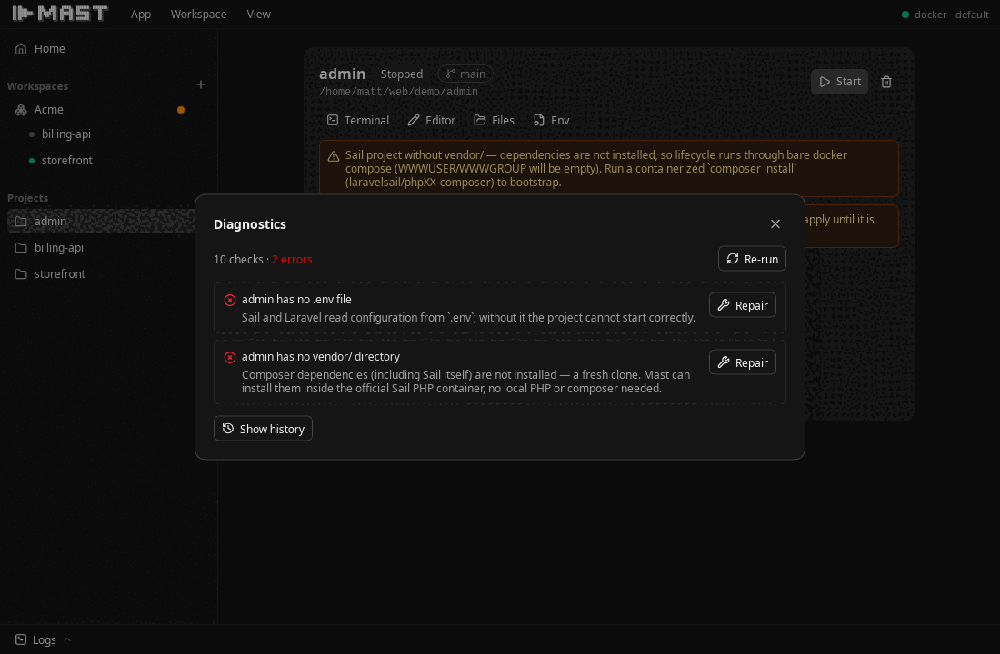

---

## Service catalog

Add common development services without manually rebuilding Compose configuration from scratch.

Mast matches services against your existing Compose file and can expose available registry versions where applicable.

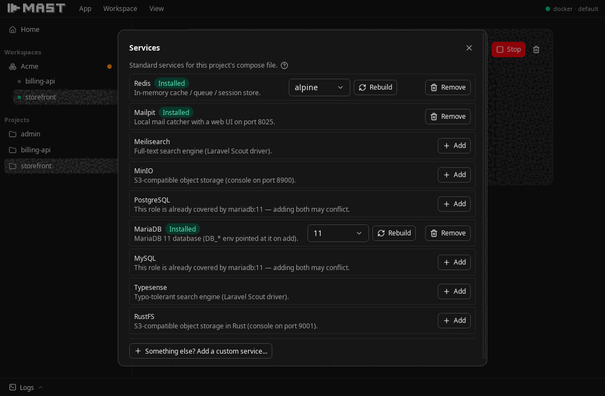

---

## Switch PHP and Node versions

Pick another PHP runtime from the project's Runtimes row and Mast runs the whole switch as one operation: the build context and the `sail-X.Y/app` image tag move together, the image rebuilds without cache, the container is recreated if it was running — and `php -v` inside the container has the last word.

Node gets the same treatment: pick a major, Mast pins the build argument, rebuilds, and `node -v` confirms it.

A version that can't work is refused up front, naming the ones that can.

The PHP chip also answers what the runtime actually is: the classic limits (`memory_limit`, upload sizes, execution time) and every loaded extension, read live from the running container. Buttons open the runtime's `php.ini` or `Dockerfile` in your editor, and **Rebuild to apply** makes the edit real — no hunting for which file feeds the image.

---

## Environment editor

Edit `.env` values directly from the project view.

Sensitive values remain masked while Mast edits the existing file in place.

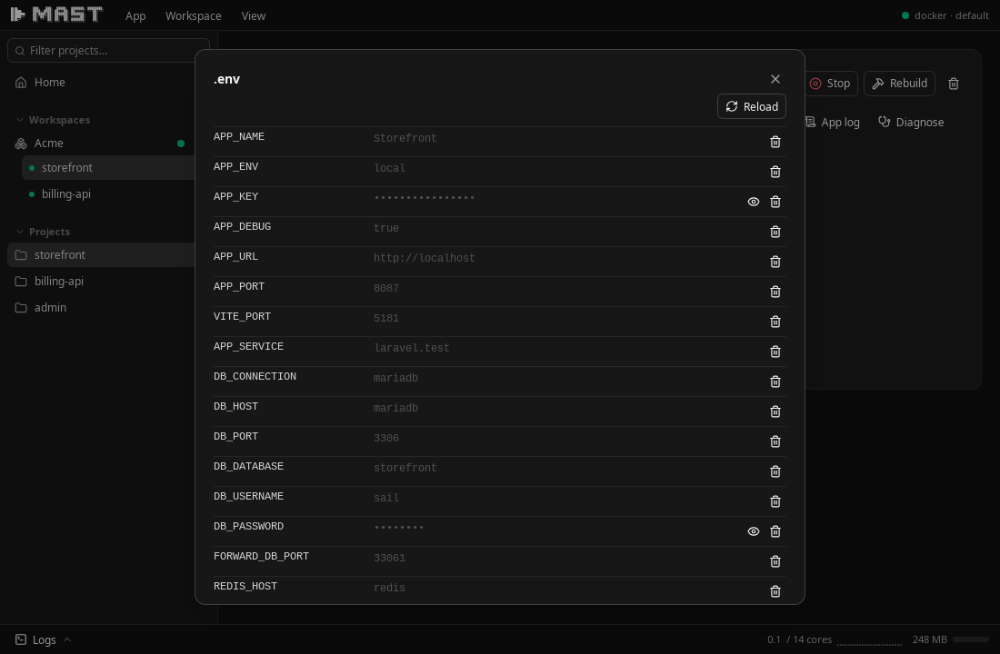

---

## Create Laravel projects without local PHP

Mast can bootstrap new Laravel applications using containers.

You don't need a local PHP installation just to create the project that will ultimately run inside Docker anyway.

---

# CLI

Mast isn't limited to the desktop interface.

The `mast` CLI talks to the same engine as the desktop application and system tray.

```bash
mast status
mast start <project>
mast stop <project>
mast restart <project>
mast diagnose
mast history
```

Control an individual service with:

```bash
mast start <project> --service <name>
```

Projects can be matched by name or path fragment.

When the desktop application or daemon is running, the CLI connects to it over IPC.

Otherwise, the CLI starts its own embedded engine. If another Mast process already holds the ownership lock, that engine operates read-only.

---

# How Mast works

Mast sits **on top of your existing Laravel Sail and Docker Compose workflow**.

It doesn't create a proprietary environment that your projects need to be migrated into.

Three principles guide how Mast interacts with your development environment:

### Terminal commands remain the source of behaviour

Operations performed by Mast correspond to the commands you would otherwise run yourself.

### Docker inspection remains the source of truth

Mast asks Docker what's actually running rather than relying on cached application state.

Changes made outside Mast remain visible inside Mast.

### File writes are validated transactions

When Mast changes project configuration, writes are validated rather than treated as arbitrary text manipulation.

The goal is simple:

**Mast should make Sail easier to operate without making your projects dependent on Mast.**

---

# Architecture

Mast is built with **Rust**, **Tauri 2**, and **Vue 3**.

A single Rust engine owns application state, and every client communicates with it through the same `MastClient` trait.

```text
Desktop App ─┐
System Tray ─┼─ MastClient ── mast-engine ── Docker / Compose / Laravel
mast CLI ────┘   in-process, or over an IPC socket to the owning process
```

Whichever process holds the engine serves a Unix socket.

This allows the CLI to retain full control while the desktop application is running while still allowing either client to operate independently.

A headless `mast-daemon` binary serves the same socket without requiring the GUI.

Architecture decisions and their reasoning are documented in:

```text
docs/adr/
```

---

# Development

## Build dependencies

### Debian / Ubuntu

Install the required system packages:

```bash
sudo apt update

sudo apt install \
  build-essential \
  curl \
  libwebkit2gtk-4.1-dev \
  libssl-dev \
  libgtk-3-dev \
  libayatana-appindicator3-dev \
  librsvg2-dev
```

Install Rust and Vite+:

```bash
curl --proto '=https' --tlsv1.2 -sSf https://sh.rustup.rs | sh
curl -fsSL https://vite.plus | bash
```

Open a new terminal, then install the Tauri CLI:

```bash
cargo install tauri-cli --version '^2.0.0' --locked
```

---

## Build from source

Clone Mast:

```bash
git clone <repository>
cd mast
```

Install dependencies:

```bash
vp install
```

Build the desktop application:

```bash
cargo tauri build
```

Configured Linux bundle targets are:

- `.deb`
- `.rpm`
- AppImage

Bundles are written to:

```text
target/release/bundle/
```

Build the optional CLI separately:

```bash
cargo build --release -p mast-cli
```

The resulting binary is:

```text
target/release/mast
```

---

## Build a Debian package

Build only the Debian bundle:

```bash
cargo tauri build --bundles deb
```

The package is written to:

```text
target/release/bundle/deb/Mast_<version>_<architecture>.deb
```

Install it with:

```bash
sudo apt install ./target/release/bundle/deb/Mast_<version>_<architecture>.deb
```

The desktop bundle installs the GUI only.

The `mast` CLI can be distributed separately from:

```text
target/release/mast
```

or bundled using `externalBin` in `tauri.conf.json`.

### AppIndicator build errors

If the build fails with:

```text
Can't detect any appindicator library
```

install the development package:

```bash
sudo apt install libayatana-appindicator3-dev
```

The runtime library alone is not sufficient because Tauri locates AppIndicator using `pkg-config`.

### Cross-architecture builds

Cross-architecture builds are not currently configured.

Build `arm64` packages on an `arm64` host or inside a matching environment with the same build dependencies installed.

---

# Running Mast for development

Install dependencies after cloning or pulling changes:

```bash
vp install
```

Start the desktop application from the repository root:

```bash
cargo tauri dev
```

Tauri automatically starts the frontend development server (`vp dev`) on port `1420` and launches the desktop application.

## Running the frontend manually

If you need to run the frontend separately:

```bash
cd clients/desktop-vue
vp dev
```

Do **not** run `vp dev` from the repository root.

The root `vite.config.ts` configures the Vite+ workspace, while the application configuration lives in:

```text
clients/desktop-vue/
```

If Tauri remains on:

```text
Waiting for your frontend dev server
```

clear any stale Vite+ process holding port `1420`:

```bash
pkill -f vite-plus-core
```

Then run:

```bash
cargo tauri dev
```

---

# Running tests

Run the Rust workspace tests:

```bash
cargo test --workspace
```

Run the frontend tests:

```bash
cd clients/desktop-vue
vp test run
```

Tests that require Docker skip cleanly when Docker is unavailable.

Fixtures under `fixtures/` contain deliberate formatting traps used to prove byte-faithful editing.

**Do not reformat them.**

---

# Contributing

Issues, bug reports, and contributions are welcome.

Mast is particularly interested in feedback from developers using **Laravel Sail on Linux** and developers working across multiple local Laravel projects.

If Mast doesn't understand something about your existing Sail or Compose setup, open an issue with the relevant configuration and expected behaviour.
